# Department of Mechanical Engineering  

## Message from HoD's Desk

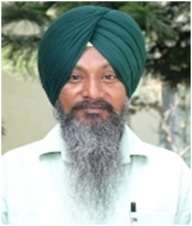  

It is a matter of great pleasure and I would like to share few of my thoughts. The Department is flourishing and achieving new heights by getting two patents granted to the department by Patent Office, Govt. of India.
Our staff members actively involved in research and development activities. Our faculty members have published their research work in various reputed journals with good impact factors and carrying out research in diverse fields of Mechanical and Production Engineering. Students of department are also bringing laurel to the institute by participating in various curricular and extra-curricular activities from time-to-time at national and international levels. Department is supporting students in all domains for their overall personality development and organizing different events through societies and clubs managed by department.

  I personally and on the behalf of the department congratulate the Newsletter team for their appreciable efforts in compiling and publishing the important outcomes of the Department.

***Dr. Harmeet Singh***  
 *HOD, Mechanical and Production Engineering Department*

## Department at Glimpse

## Faculty Achievements  

- **Dr. Harmeet Singh**, Professor Mechanical & Production Engineering Department joined HOD (MPE) with effect from  July, 2023.
- **Dr. Raman Kumar** awarded World's Top 2% Scientist for 2023 by Stanford University for Second time. 

## Ph.D. Awarded

-	**Dr. Prem Singh**  has completed his Ph.D. in Mechanical Engineering from Punjabi University, Patiala
-	**Dr. Satjot Singh** Dhillon  has completed his Ph.D. in Mechanical Engineering from Punjab Technical University, Jalandhar
-	**Dr. Gulvir Singh**  has completed his Ph.D. in Mechanical Engineering from SLITE, Langowal 
-	**Dr. Jatinder Pal**  has completed his Ph.D. in Mechanical Engineering from Thaper University, Patiala
-	**Dr. Shehbaaz Singh** Brar  has completed his Ph.D. in Mechanical Engineering from Punjab Technical University, Jalandhar  

## Patent Granted

- Patent No.459333 dated: 15th May 2019 awarded on 16th October 2023 “HIGH-TEMPERATURE OXIDATION AND EROSION RESISTANT ALLOY-718/ AL2O3 COMPOSITE COATINGS” Patentee: 1. Dr. Hitesh Vasudev 2. Dr. Lalit Thakur 3. **Dr. Harmeet Singh** 4. Dr. Amit Bansa

  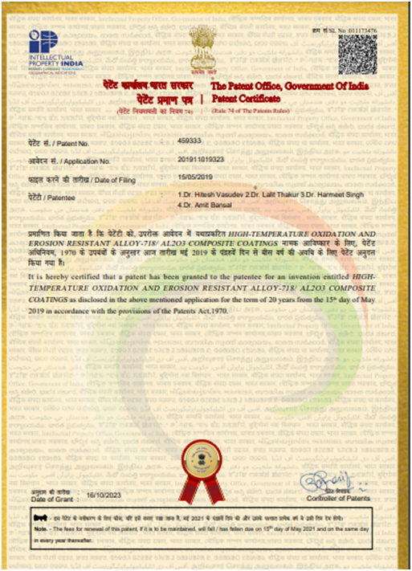
  
-	Patent Number- 537875 Dated 28/04/2021 awarded on 14/05/2024“INTERNAL SWAGING MACHINE” Patentee : 1. **Dr. Gulvir Singh**,  **Dr. Jatinder Kapoor** and **Dr. Sehijpal Singh**
  
 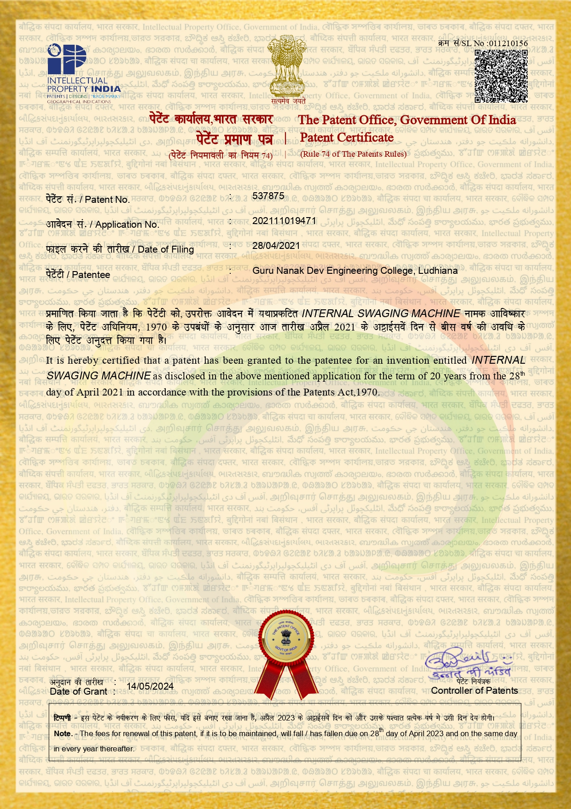

## Publications  

- Jain, Pragyan, R. S. Rajput, Sunil Kumar, Arti Sharma, Akshay Jain, Bhaskor Jyoti Bora, Prabhakar Sharma, **Raman Kumar** et al. "Recent Advances in Graphene-Enabled Materials for Photovoltaic Applications: A Comprehensive Review." ACS omega 9, no. 11 (2024): 12403-12425. 
- S Mohanty, JIP Singh, V Dhawan, **S Singh**, A Belaadi “A review on basalt/PLA composite and its chemical and mechanical properties” (2023) AIP Conference Proceedings 2962 (1)
- Subhrajeet Mohanty; Jai Inder Preet Singh; Vikas Dhawan; **Sehijpal Singh**; Ahmed Belaadi “A review on basalt/PLA composite and its chemical and mechanical properties”   AIP Conf. Proc. 2962, 020016 (2024) https://doi.org/10.1063/5.0192257
- VA Ajitesh, JI Preet Singh, **S Singh**, V Dhawan, V Sharma “A review on natural fibres: Its applications, chemical and mechanical properties” AIP Conf. Proc. 2962, 020025 (2024) https://doi.org/10.1063/5.0192259
- Dev, Nikhil, **Raman Kumar**, Rajeev Kumar Saha, Atul Babbar, Vladimir Simic, and Nebojsa Bacanin. "Performance evaluation methodology for gas turbine power plants using graph theory and combinatorics." International Journal of Hydrogen Energy 57 (2024): 1286-1301. 
- Singh, P.P., Madan, J. & **Singh, H.** “System for product flow configuration selection for reconfigurable manufacturing system”. Int J Adv Manuf Technol (2024). https://doi.org/10.1007/s00170-024-14732-z
- Karim, Md Rezaul, Shah Md Ashiquzzaman Nipu, Md Sabbir Hossain Shawon, **Raman Kumar**, Sheak Salman, Amit Verma, El-Sayed M. Sherif, Saiful Islam, and Muhammad Imam Ammarullah. "Machinability investigation of natural fibers reinforced polymer matrix composite under drilling: Leveraging machine learning in bioengineering applications." AIP Advances 14, no. 4 (2024). 
- **Pal, Jatinder**, Dheeraj Gupta, and Tejinder Paul Singh. "Influence of WC-12Co reinforcement on sliding wear performance of stainless steel-based MMC processed in a microwave oven." Proceedings of the Institution of Mechanical Engineers, Part C: Journal of Mechanical Engineering Science (2024): 09544062241228389. 
- **Pal, Jatinder**, Dheeraj Gupta, and Tejinder Paul Singh. "Flexural behavior of SS316-based metal matrix composite prepared through microwave heating." Proceedings of the Institution of Mechanical Engineers, Part C: Journal of Mechanical Engineering Science (2024): 09544062241251981. 
-	Amandeep Singh, Naser Nawayseh, YashKumar Dhabi, Siby Samuel, **Harwinder Singh** “Transforming farming with intelligence: Smart vibration monitoring and alert system” (2024) Journal of Engineering Research Volume 12, Issue 2, June 2024, Pages 190-199
-	Harikrishna, Katika, Abhijit Bhowmik, M. J. Davidson, **Raman Kumar**, Ali E. Anqi, Ali A. Rajhi, and Sagr Alamri. "Evaluation of constitutive equations for modeling and characterization of microstructure during hot deformation of sintered Al–Zn–Mg alloy." Journal of Materials Research and Technology 28 (2024): 1523-1537. 
-	Babu, E. R., Nagaraja C. Reddy, Atul Babbar, A. Chandrashekar, **Raman Kumar**, Pardeep Singh Bains, Majed Alsubih et al. "Characteristics of pulsating heat pipe with variation of tube diameter, filling ratio, and SiO2 nanoparticles: Biomedical and engineering implications." Case Studies in Thermal Engineering 55 (2024): 104065. 
-	Rao, Papabathina Mastan, Sneha Haresh Dhoria, S. Gopal Krishna Patro, Radha Krishna Gopidesi, Meshel Q. Alkahtani, Saiful Islam, Murkonda Vijaya, **Raman Kumar** et al. "Artificial intelligence based modelling and hybrid optimization of linseed oil biodiesel with graphene nanoparticles to stringent biomedical safety and environmental standards." Case Studies in Thermal Engineering 51 (2023): 103554 
-	**Kumar, Raman**, Shubham Sharma, Ranvijay Kumar, Sanjeev Verma, and Mohammad Rafighi. "Review of lubrication and cooling in computer numerical control (CNC) machine tools: a content and visualization analysis, research hotspots and gaps." Sustainability 15, no. 6 (2023): 4970. 
-	 Erappa Rajj, Babu, Madeva Nagaral, Sanjay Chintakindi, **Raman Kumar**, Ali E. Anqi, Ali A. Rajhi, Alaauldeen A. Duhduh et al. "Nano-Sized Al2O3–Gr Reinforced Al7075 Hybrid Composite: Impact of Cooling Agents on Mechanical, Wear, and Fracture Behavior." ACS omega 9, no. 16 (2024): 17878-17890. 
-	Singh, Jagmeet, Inderpreet Singh Ahuja, **Harwinder Singh**, and Amandeep Singh. "Application of quality 4.0 (Q4. 0) and industrial internet of Things (IIoT) in agricultural manufacturing industry." AgriEngineering 5, no. 1 (2023): 537-565. 
-	Amandeep Singh , Naser Nawayseh, **Harwinder Singh**, YashKumar Dhabi , Siby Samuel “Internet of agriculture: Analyzing and predicting tractor ride comfort through supervised machine learning” (2023) Engineering Applications of Artificial Intelligence Volume 125, October 2023, 106720
-	A Singh, N Nawayseh, S Samuel, YK Dhabi, **H Singh** “Real time vibration monitoring and analysis of agricultural tractor drivers using an IoT based system” (2023) Journal of Field Robotics 40 (7), 1723-1738
-	J Singh, IS Ahuja, **H Singh**, A Singh “Application of quality 4.0 (Q4. 0) and industrial internet of Things (IIoT) in agricultural manufacturing industry” (2023) AgriEngineering 5 (1), 537-565
-	K Singh, G Singh, **H Singh** “The influence of holding time on the characteristics of friction stir welded dissimilar magnesium alloy joints during post welding heat treatment” (2023) Proceedings of the Institution of Mechanical Engineers, Part L: Journal of Materials: Design and Applications Volume 237 (1) 170-182.
-	Singh, Baljeet, and **Jasmaninder Singh Grewal**. "Wear behavior and surface characterization of grey cast iron GG25 under lubricated sliding conditions." In AIP Conference Proceedings, vol. 2986, no. 1. AIP Publishing, 2024. DOI: 10.1063/5.0195854 
-	Kiran, M. D., Lokesh Yadhav BR, Atul Babbar, **Raman Kumar**, Sharath Chandra HS, Rashmi P. Shetty, K. B. Sudeepa, Rupinder Kaur, Meshel Q. Alkahtani, and Saiful Islam. "Tribological properties of CNT-filled epoxy-carbon fabric composites: optimization and modelling by machine learning." Journal of Materials Research and Technology 28 (2024): 2582-2601. DOI:10.1016/j.jmrt.2023.12.175 
-	Saha, Rajeev Kumar, **Raman Kumar**, Nikhil Dev, Rajender Kumar, Raul M. Del Toro, Sofía Haber, and José E. Naranjo. "Structural modeling and analysis of fuel cell: a graph-theoretic approach." PeerJ Computer Science 9 (2023): e1510. DOI: 10.7717/peerj-cs.1510 
-	**Kumar, Raman**, Rajeev Saha, Vladimir Simic, Nikhil Dev, Rajender Kumar, Harish Kumar Banga, Nebojsa Bacanin, and Sanjeet Singh. "Rooftop solar potential in micro, small, and medium size enterprises: An insight into renewable energy tapping by decision-making approach." Solar Energy 276 (2024): 112692. DOI:10.1016/j.solener.2024.112692 
-	Jain, Pragyan, R. S. Rajput, Sunil Kumar, Arti Sharma, Akshay Jain, Bhaskor Jyoti Bora, Prabhakar Sharma, **Raman Kumar** et al. "Recent Advances in Graphene-Enabled Materials for Photovoltaic Applications: A Comprehensive Review." ACS omega 9, no. 11 (2024): 12403-12425. DOI: 10.1021/acsomega.3c07994. 
-	Dev, Nikhil, **Raman Kumar**, Rajeev Kumar Saha, Atul Babbar, Vladimir Simic, and Nebojsa Bacanin. "Performance evaluation methodology for gas turbine power plants using graph theory and combinatorics." International Journal of Hydrogen Energy 57 (2024): 1286-1301. DOI: https://doi.org/10.1016/j.ijhydene.2024.01.064 
-	Karim, Md Rezaul, Shah Md Ashiquzzaman Nipu, Md Sabbir Hossain Shawon, **Raman Kumar**, Sheak Salman, Amit Verma, El-Sayed M. Sherif, Saiful Islam, and Muhammad Imam Ammarullah. "Machinability investigation of natural fibers reinforced polymer matrix composite under drilling: Leveraging machine learning in bioengineering applications." AIP Advances 14, no. 4 (2024). DOI: https://doi.org/10.1063/5.0200625 
-	**Pal, Jatinder**, Dheeraj Gupta, and Tejinder Paul Singh. "Influence of WC-12Co reinforcement on sliding wear performance of stainless steel-based MMC processed in a microwave oven." Proceedings of the Institution of Mechanical Engineers, Part C: Journal of Mechanical Engineering Science (2024): 09544062241228389. DOI: https://doi.org/10.1177/09544062241228389 
-	**Pal, Jatinder**, Dheeraj Gupta, and Tejinder Paul Singh. "Flexural behavior of SS316-based metal matrix composite prepared through microwave heating." Proceedings of the Institution of Mechanical Engineers, Part C: Journal of Mechanical Engineering Science (2024):09544062241251981.DOI:https://doi.org/10.1177/09544062241251981 
-	Harikrishna, Katika, Abhijit Bhowmik, M. J. Davidson, **Raman Kumar**, Ali E. Anqi, Ali A. Rajhi, and Sagr Alamri. "Evaluation of constitutive equations for modeling and characterization of microstructure during hot deformation of sintered Al–Zn–Mg alloy." Journal of Materials Research and Technology 28 (2024): 1523-1537. DOI:10.1016/j.jmrt.2023.12.050 
-	Harikrishna, Katika, Abhijit Bhowmik, M. J. Davidson, **Raman Kumar**, Ali E. Anqi, Ali A. Rajhi, and Sagr Alamri. "Evaluation of constitutive equations for modeling and characterization of microstructure during hot deformation of sintered Al–Zn–Mg alloy." Journal of Materials Research and Technology 28 (2024): 1523-1537. DOI:10.1016/j.jmrt.2023.12.050 
-	Harikrishna, Katika, Abhijit Bhowmik, M. J. Davidson, **Raman Kumar**, Ali E. Anqi, Ali A. Rajhi, and Sagr Alamri. "Evaluation of constitutive equations for modeling and characterization of microstructure during hot deformation of sintered Al–Zn–Mg alloy." Journal of Materials Research and Technology 28 (2024): 1523-1537. DOI:10.1016/j.jmrt.2023.12.050 
-	 **Farwaha, Harnam Singh**, **Prem Singh**, Mukesh Kumar, Nishant Ranjan, and Harpreet Kaur. "Enhancing sustainability in manufacturing: A case study on reducing changeover time through single minute exchange of dies and risk analysis." In AIP Conference Proceedings, vol. 3050, no. 1. AIP Publishing, 2024. DOI: https://doi.org/10.1063/5.0193678 
-	Babu, E. R., Nagaraja C. Reddy, Atul Babbar, A. Chandrashekar, **Raman Kumar**, Pardeep Singh Bains, Majed Alsubih et al. "Characteristics of pulsating heat pipe with variation of tube diameter, filling ratio, and SiO2 nanoparticles: Biomedical and engineering implications." Case Studies in Thermal Engineering 55 (2024): 104065. DOI:10.1016/j.csite.2024.104065 
-	Rao, Papabathina Mastan, Sneha Haresh Dhoria, S. Gopal Krishna Patro, Radha Krishna Gopidesi, Meshel Q. Alkahtani, Saiful Islam, Murkonda Vijaya, **Raman Kumar** et al. "Artificial intelligence based modelling and hybrid optimization of linseed oil biodiesel with graphene nanoparticles to stringent biomedical safety and environmental standards." Case Studies in Thermal Engineering 51 (2023): 103554. DOI:10.1016/j.csite.2023.103554 
-	**Sidhu, Ardamanbir Singh**, **Raman Kumar**, **Sehijpal Singh**, and Harpreet Kaur. "Efficiency Enhancement and Energy Optimization in Alloy Steel Drilling: An Experimental and Statistical Analysis." In International Conference on Intelligent Manufacturing and Energy Sustainability, pp. 269-279. Singapore: Springer Nature Singapore, 2023. DOI: https://doi.org/10.1007/978-981-99-6774-2_25 
-	**Kumar, Raman**, Shubham Sharma, Ranvijay Kumar, Sanjeev Verma, and Mohammad Rafighi. "Review of lubrication and cooling in computer numerical control (CNC) machine tools: a content and visualization analysis, research hotspots and gaps." Sustainability 15, no. 6 (2023): 4970. DOI:https://doi.org/10.3390/su15064970. 
-	**Dhand, Deepak**, **Jasmaninder Singh Grewal**, and Parlad Kumar. "The microstructural characterization and wear behaviour of HVOF sprayed Nickel-Alumina coatings on boiler grade steel." In AIP Conference Proceedings, vol. 2715, no. 1. AIP Publishing, 2023. DOI:https://doi.org/10.1063/5.0134199 
-	Erappa Rajj, Babu, Madeva Nagaral, Sanjay Chintakindi, **Raman Kumar**, Ali E. Anqi, Ali A. Rajhi, Alaauldeen A. Duhduh et al. "Nano-Sized Al2O3–Gr Reinforced Al7075 Hybrid Composite: Impact of Cooling Agents on Mechanical, Wear, and Fracture Behavior." ACS omega 9, no. 16 (2024): 17878-17890. DOI:https://doi.org/10.1021/acsomega.3c08822 
-	Singh, Jagmeet, Inderpreet Singh Ahuja, **Harwinder Singh**, and Amandeep Singh. "Application of quality 4.0 (Q4. 0) and industrial internet of Things (IIoT) in agricultural manufacturing industry." Agri Engineering 5, no. 1 (2023): 537-565. DOI:https://doi.org/10.3390/ agriengineering5010035 
-	**Singh, Gulvir**, and Pradeep K. Singh. "Effect of process parameters on performance of grooved hot rolling of SAE 4340 steel bars." Materials and Manufacturing Processes 38, no. 2 (2023): 206-219.
-	**Singh, Gulvir**, and Pradeep K. Singh. "Modelling and optimization of process parameters during grooved hot rolling of SAE 1020 steel." Materials and Manufacturing Processes 38, no. 6 (2023): 701-721.
-	**Singh, Gulvir**, and Pradeep K. Singh. "Improving the energy efficiency and process scrap in grooved hot rolling of SAE 52100 steel billets." CIRP Journal of Manufacturing Science and Technology 41 (2023): 55-68.
-	**Singh, Gulvir**, and Pradeep K. Singh. "Effect of process parameters on roll separating force, driving torque, and end crop length during grooved hot rolling of SAE 1541 steel." The International Journal of Advanced Manufacturing Technology 124, no. 7 (2023): 2463-2482.
-	**Singh, Gulvir**, and Pradeep K. Singh. "Hot profiled rolling of C40 steel: production variable’s effect on rolling performance." Materials and Manufacturing Processes 39, no. 7 (2024): 871-891.
-	**Singh, Gulvir**, and Pradeep K. Singh. "Modeling and Optimization of Process Parameters during Grooved Hot Rolling of SAE 1541 Steel." Journal of Materials Engineering and Performance 32, no. 22 (2023): 10128-10140.
-	**Singh, Gulvir**, and Pradeep K. Singh. "Process variable optimization for hot-profiled rolling of SAE 52100 steel." International journal of precision engineering and manufacturing 24, no. 8 (2023): 1425-1433.
-	**Singh, Gulvir**, and Pradeep K. Singh. "Reduction of energy and fuel consumption in the hot-rolling steel sector." Cleaner Engineering and Technology 17 (2023): 100689.

## Book  Published

| Sr. No. | Authors          |  Book Title      | Year      |  Publisher / ISBN No.    |
|:--------|:-------------------------|:------------------------------------------------------------------------------------|:-----------------------|:-------------------------------------------------------------------------------|
|1| **Raman Kumar**, Sita Rani, **Sehijpal Singh** | Machine Learning for Sustainable Manufacturing in Industry 4.0: Concept, Concerns and Applications	|2023| 		CRC Press	9781003453567|

## Book Chapters Published

| Sr. No. | Authors          | Title      | Year      | Title of Book/ Publisher/ Page/ISBN No.    |
|:--------|:-------------------------|:------------------------------------------------------------------------------------|:-----------------------|:-------------------------------------------------------------------------------|
|1|Harpreet Kaur Channi, **Raman Kumar**|Chapter 14 - Digital technologies for fostering sustainability in Industry 4.0| 2024| Digital technologies for fostering sustainability in Industry 4.0." In Evolution and Trends of Sustainable Approaches, pp. 227-251. Elsevier, 2024. https://doi.org/10.1016/B978-0-443-21651-0.00016-4 |
|2|**Raman Kumar** Harpreet Kaur Channi, Harish Kumar Banga|Data Analytics in Agriculture: Predictive Models and Real-Time Decision-Making|2024|AData Analytics in Agriculture. In Smart Agritech (eds S.K. Srivastava, D. Srivastava, K. Cengiz and P. Gaur).https://doi.org/10.1002/9781394302994.ch7|
|3|Ramandeep Singh Sidhu &  **Raman Kumar**| Machine learning-enabled powder-spreading process|2024| Additive Manufacturing Materials and Technologies; Machine Learning for Powder-Based Metal Additive Manufacturing,Edited by Gurminder Singh, Farhad Imani, Asim Tewari, Sushil Mishra, Elsevier, 2024, pp. 107-130; ISBN: 978-0-443-22145-3 |
|4|Harpreet Kaur Channi and **Raman Kumar**|Machine learning for metaladditive manufacturing process optimization |2024|Additive Manufacturing Materials andTechnologies; Machine Learning forPowder-Based MetalAdditive Manufacturing, Edited byGurminder Singh, Farhad Imani, Asim Tewari, Sushil Mishra, Elsevier, 2024, pp. 131-154; ISBN: 978-0-443-22145-3 |
|5|**Raman Kumar**, Nishant Ranjan, Ramandeep Singh Sidhu, Bhowmik Abhijit, Sushant|Chapter 4 Role of fillers and various sustainable innovations in the use of filler material for the preparation of composites|2024|"Green Composites Manufacturing: A Sustainable Approach, edited by Gurminder Singh, Ravinder Pal Singh, Neeraj Sharma and J. Paulo Davim, Berlin, Boston: De Gruyter, 2024, pp. 79-104. https://doi.org/10.1515/9783111067346-004 |
|6|Vidyapati Kumar, Ankita Mistri, Atul Babbar, Vikas Dhawan, **Raman Kumar**, Lavish Kumar Singh, Ankit Sharma|Biomimicry-Inspired Design of Sustainable Composite Materials|2024|"Fabrication Techniques and Machining Methods of Advanced Composite Materials " CRC PresseBook ISBN9781003427735 |
|7|Rupinder Kaur, **Raman Kumar**, Himanshu Aggarwal |Role of Machine Learning in Sustainable Manufacturing Practices: An Outline|2023|"International Conference on Intelligent Manufacturing and Energy Sustainability. Singapore: Springer Nature Singapore, 2023 |
|8|Harpreet Kaur, **Raman Kumar**, Pulkit Kumar, Swapandeep Kaur, Krishna Kant Dixit, Hemant Sharma |Efficient and Cost-Effective Renewable Energy Integration of Photovoltaic and Hydro in Rural India using HOMER Pro: A Case Study of Chupki, Punjab|2023|In International Conference on Intelligent Manufacturing and Energy Sustainability, pp. 281-291. Singapore: Springer Nature Singapore, 2023. |
|9|**Ardamanbir Singh Sidhu, Raman Kumar, Sehijpal Singh**, Harpreet Kaur  |Efficiency Enhancement and Energy Optimization in Alloy Steel Drilling: An Experimental and Statistical Analysis|2023|In International Conference on Intelligent Manufacturing and Energy Sustainability, pp. 269-279. Singapore: Springer Nature Singapore, 2023. |
|10|Swapandeep Kaur, **Raman Kumar**, Kanwardeep Singh  |Smart Grids and Solar Energy: Role of Artificial Intelligence in Grid Management|2023|Futuristic Trends in Renewable & Sustainable Energy, under Volume 3, 2023, IIP Proceedings  |
|11|Swapandeep Kaur, **Raman Kumar**, Harpreet Kaur Channi, Kanwardeep Singh  | Design and Optimization of Photovoltaic Microgrid Using Homer Pro Software|2023|Optimization in Sustainable Energy: Methods and Applications Under Review  |
|12| **Raman Kumar**, HRaman Kumar, Ranvijay Kumar, **Jatinder Pal**  | Machine Learning in Post-Processing of Fused Deposition Modelling Parts |2023| "Post processing treatments for fused deposition modelling 3d printed parts - techniques and advancements" (editors: vinayak r. Malik, vivek tiwary & arunkumar p.) That will be published by taylor and francis, CRC press, USA. Accepted in press  |
|12| **Raman Kumar**, Nishant Ranjan, Ramandeep Singh Sidhu, Abhijit Bhowmik  | Role of Fillers and Various Sustainable Innovations in the Use of Filler Material for the Preparation of Composites |2023| Green Composites Manufacturing: A Sustainable Approach. Published by “De Gruyter”. Accepted in Press |
|13| Harpreet Kaur Channi, **Raman Kumar**, Ramandeep Singh Sidhu, Rajender Kumar, Sushant	| Machining of Carbon Nanotubes Reinforced Epoxy Composites| 2024	| "Fabrication Techniques and Machining Methods of Advanced Composite Materials " CRC Press 137-162/ eBook SBN9781003427735|
|14| **Raman Kumar**, Harpreet Kaur Channi, Harish Kumar Banga| 	Data Analytics in Agriculture: Predictive Models and Real-Time Decision Making |	2023 |	Smart Agritech: Potential of Robotics, AI, and Internet of Things (IoT) in Agriculture (SAPRAIA2023) Accepted in Press|
|15| **Raman Kumar**, Amit Verma |	Machine learning for resource optimization in Industry 4.0 eco-system	| 2023 |	Machine Learning for Sustainable Manufacturing in Industry 4.0: Concept, Concerns and Applications (1st ed.). CRC Press. ttps://doi.org/10.1201/9781003453567| 
|16| **Raman Kumar**, **Chamkaur Jindal**, Sita Rani, **Sehijpal Singh Khangura**	| Applications of machine learning in smart factory in fourth-generation industrial environment | 	2023 |	Machine Learning for Sustainable Manufacturing in Industry 4.0: Concept, Concerns and Applications (1st ed.). CRC Press. https://doi.org/10.1201/9781003453567 |
|17| Harpreet Kaur Channi, **Raman Kumar**	| Role of machine learning in Industry 4.0 applications: A review	| 2023 |	Kumar, R., Rani, S., & Singh Khangura, S. (Eds.). (2023). Machine Learning for Sustainable Manufacturing in Industry 4.0: Concept, Concerns and Applications (1st ed.). CRC Press. https://doi.org/10.1201/9781003453567 |
|18| Abhishek Bhattacharjee, **Raman Kumar** |	Environmental impact of operations and supply chain from Fourth Industrial Revolution and machine learning approaches |	2023|	Kumar, R., Rani, S., & Singh Khangura, S. (Eds.). (2023). Machine Learning for Sustainable Manufacturing in Industry 4.0: Concept, Concerns and Applications (1st ed.). CRC Press. https://doi.org/10.1201/9781003453567|
|19| **Jagdeep Singh and Prem Singh** |	Application of Queuing Technique in an Educational Institute Canteen: A Case Study Pages 234 – 245 | 	2023 |	Integration of AI-Based Manufacturing and Industrial Engineering Systems with the Internet of Things Published December 22, 2023 by CRC Press Taylor & Francis ISBN 9781032466019|

## Conference attended
| Sr. No. |  Name         |   Name of the Conference     |  Place     |  Duration    |
|:--------|:-------------------------|:------------------------------------------------------------------------------------|:-----------------------|:-------------------------------------------------------------------------------|
|1| **Dr. Harnam Singh Farwaha**	| 2nd International Conference on Sustainable Nanotechnology and Nanomaterials (ICONN-2023)	| Chandigarh University, Gharuan, Mohali.|	27/07/2023 to 28/07/2023|
|2| **Dr. Harnam Singh Farwaha** |	1st International Conference on Advances in Mechanical and Sustainable Engineering (CAMSE-2024)	| Punjabi University, Patiala. |	11/03/2024 to 12/03/2024|
|3| **Singh Satwant**, **Singh Harmeet**, **Kumar Raman** |	Impact of wiper inserts on Machining Performance: A comprehensive review” at 3rd International conference and exposition on mechanical, material and manufacturing technology |	CVR College of engineering, Hyderabad	| 24th -26th October 2024|
|4| Rupinder Kaur, **Raman Kumar**, Himanshu Aggarwal |	Role of Machine Learning in Sustainable Manufacturing Practices: An Outline at Fifth International Conference Intelligent Manufacturing and Energy Sustainability (ICIMES-2023) Innovation Ecosystems for Industry 5.0 	| Malla Reddy College of Engineering and Technology (MRCET), Dhulapally, Near KompallySecunderabad – 500100, Telangana State, India	|June 23-24, 2023|
|5| Harpreet Kaur, **Raman Kumar**, Pulkit Kumar, Swapandeep Kaur, Krishna Kant Dixit, Hemant Sharma | Efficient and Cost-Effective Renewable Energy Integration of Photovoltaic and Hydro in Rural India using HOMER Pro: A Case Study of Chupki, Punjab at  Fifth International ConferenceIntelligent Manufacturing and Energy Sustainability (ICIMES-2023) Innovation Ecosystems for Industry 5.0 |	Malla Reddy College of Engineering and Technology (MRCET), Dhulapally, Near KompallySecunderabad – 500100, Telangana State|	June 23-24, 2023|
|6| **Ardamanbir Singh Sidhu, Raman Kumar, Sehijpal Singh**, Harpreet Kaur| Efficiency Enhancement and Energy Optimization in Alloy Steel Drilling: An Experimental and Statistical Analysis at Fifth International Conference Intelligent Manufacturing and Energy Sustainability (ICIMES-2023) Innovation Ecosystems for Industry 5.0| 	Malla Reddy College of Engineering and Technology (MRCET), Dhulapally, Near KompallySecunderabad – 500100, Telangana State, India.	|June 23-24, 2023| 
|7| **Raman Kumar**, Rupinder Kaur, Gitanjali, Harpreet Kaur Channi, Karneet Kaur |	Integrating Sustainable Energy Systems and Artificial Intelligence: Transforming the Future of Energy at  Fifth International Conference Intelligent Manufacturing and Energy Sustainability (ICIMES-2023) Innovation Ecosystems for Industry 5.0	| Malla Reddy College of Engineering and Technology (MRCET), Dhulapally, Near KompallySecunderabad – 500100, Telangana State, India	|June 23-24, 2023,.|
|8| Swapandeep Kaur, **Raman Kumar**, Kanwardeep Singh |	An Overview of Drivers and Barriers to Renewable Energy Systems at  International Conference on Green Energy 2023 | AISSMS College of Engineering, Pune	|16-17 May, 2023 |

## Events Attended (FDPs/Conferences/STCs/SDTs/Workshops/Webinars etc.)  

| Sr. No. | Name of Faculty          | Name of Event                                                                       | Date(s)                | Organizing Institute                                                           |
|:--------|:-------------------------|:------------------------------------------------------------------------------------|:-----------------------|:-------------------------------------------------------------------------------|
| 1 |Dr. Gulvir Singh	| Finite Element Analysis using ABAQUS, TOSCA, ISIGHT	| February 5, 2024 to February 9, 2024 |	NITTTR, Chandigarh.|
| 2 |Dr. Gulvir Singh	| Outcome Based Education	| November 16, 2023	| IQAC, Guru Nanak Dev Engineering College, Ludhiana.|
| 3 |Dr. Gulvir Singh	| BIS Awareness|	December, 12, 2023|	BIS, Chandigarh|
| 4 |Dr. Gulvir Singh	| Communication Skills	|August 7, 2023|	Dept. of Applied Science & IQAC, Guru Nanak Dev Engineering College, Ludhiana.|
| 5 | Dr. Chatwant Singh Pandher |	Finite Element Analysis using ABAQUS, TOSCA, ISIGHT |	05/02/2024 to 09/02/2024 (One Week)	| NITTTR, Chandigarh |
| 6 | Dr. Chatwant Singh Pandher	| Role of Technical Institutions in Rural Infrastructure Development |	24/04/2023 to 28/04/2023 (One Week)	| Rural Development Department, HIET, Shahpur, H.P.|
| 7 | Dr. Harnam Singh Farwaha |	Innovation, Research And IPR - Journey Towards Excellence |	01/03/2023 to 05/03/2023|	BVB's Sardar Patel College of Engineering, Mumbai & HSM's Shri. Sant Gadge Baba College of Engineering & Technology, Bhusawal|
| 8 | Dr. Harnam Singh Farwaha |	Recent Advancement in Material, Micro-Manufacturing and Characterization (RAMMC-23) |	13/03/2023 to 17/03/2023	| Dr. D. Y. Patil Institute of Technology, Pimpri, Pune.|
| 9 |Dr. Harnam Singh Farwaha	| IP Awareness/Training program	| 06/06/2023|	Intellectual Property Office, India.|
| 10 | Dr. Harnam Singh Farwaha	| Recent Developments In Mechanical Engineering|	19/06/2023 to 23/06/2023|	Eswar College of Engineering, Kakinada, AP.|
| 11 | Dr. Harnam Singh Farwaha |	Computer Aided Engineering Analysis Using Ansys	| 17/07/2023 to 21/07/2023 |	Vishwakarma Institute Of Information Technology, Pune.|
| 12 | Dr. Harnam Singh Farwaha	| Recent Advances in Mechanical Engineering (RAME-23) |	24/07/2023 to 28/07/2023 |	Dr. D. Y. Patil Institute Of Technology, Pimpri, Pune.|
| 12 |Dr. Harnam Singh Farwaha |	Recent Advances and Challenges in Electric Vehicles |	21/08/2023 to 25/08/2023 |	K J College Of Engineering And Management Research, Pune.|
| 14 |Dr. Harnam Singh Farwaha	| Emerging Trends In Advance Manufacturing Technology |	20/02/2024 to 24/02/2024 |	School of Engineering & Technology, Sandip University, Nashik.|
| 15 |Dr. Harnam Singh Farwaha |	Electric Vehicle Technology |	01/03/2024 to 02/03/2024 |	Matoshri Institute of Technology, Dhanore and EVRobotics Skill Coach (India) Pvt. Ltd. Mumbai|
| 16 |Dr. Harnam Singh Farwaha	| Additive Manufacturing Technology|	04/03/2024 to 09/03/2024|	School of Engineering & Technology, Sandip University, Nashik.|
| 17 |Dr. Harnam Singh Farwaha	|3D Printing & Additive Manufacturing Insights|	12/03/2024 to 16/03/2024|	National Institute of Technology, Mizoram.|
| 18 | Dr. Harnam Singh Farwaha|	Fabrication & Characterization Of Novel Fiber Reinforced Polymer Composite For Structural Application	| 22/04/2024 to 26/04/2024|	Department Of Automation & Robotics, Sandip Institute Of Technology And Research Centre, Nashik.|
| 19 |Dr. Harnam Singh Farwaha|	Revolutionizing Vibration Analysis through Artificial Intelligence and Machine Learning Integration" (RVAIML-24)” | from 11th to 15th June 2024	11/06/2024 to 15/06/2024 |	Department of Mechanical Engineering, Dr. D. Y. Patil Institute of Technology, Pimpri, Pune.|
| 20 |Dr. Harnam Singh Farwaha	| NEP 2020 Orientation & Sensitization Programme|	18/06/2024 to 28/06/2024|	Indian Institute of Information Technology, Design and Manufacturing, Kancheepuram, Chennai.|
| 21 | Dr. Raman Kumar|	"One Week Online Short Term Course on Machine Learning and its Applications in loT, Computer Vision and Cloud Computing (MICC-2023)"|	10th July to 14th July 2023	|Department of Computer Science & Engineering, National Institute of Technology Jamshedpur (NIT) Jamshedpur|
| 22 |Dr. Raman Kumar|	Innovations in Water Treatment & Sustainable Infrastructure	|29th May 2023 to 2nd June 2023	|Chandigarh Engineering College, Jhanjeri, Mohaliv
| 23 |Dr. Prem Singh|	Recent Advances and Challenges in Electric Vehicles	| 21/08/2023 to 25/08/2023|	KJ College of Engg. And Management Research|
| 24 |Dr. Prem Singh	|Additive manufacturing Technology|	04/03/2024 to 09/03/2024	|Sandip University, Nashik|
| 25 |Dr. Prem Singh	|Computational Fluid Dynamic: Bridging Theory and Practicev	|18/03/2024 to 29/03/2024	|Sinhgad College of Engineering, Pune|
| 26 |Dr. Prem Singh	|Exploring Perspectives of AI and ML in Robotics and Automation	|24/06/2024 to 28/06/2024|	Dr. D.Y. Patil Institute of Technology, Pune|

                                                                    
## Industry Institute Meet Organized
This meet was organized by Department of Mech. & Prod. Engg. and Industrial Relation Cell, GNDEC. The objective of the meet was to share expertise and experience between the industry and Institute; Providing skill and expertise to the students to be successful in the current job market. The Prominent industrialists present in the meet were Mr. Jagbir Singh Sokhi, President Sewing Machine Development Cell; Mr. Narinder Bhamra, President Fasteners Manufacturers Assoc. of (India), Mr. Gurpreet Singh Kalhon, Senior Vice president Auto Parts Manufacturers (India); Mr. Harsimerjit Singh, President United Cycle Parts, Ludhiana; Mr. Satnam Singh Makkar, Vice President, United Cycle Parts, Ludhiana. Mr. Yashpal Gosian, President; Ludhiana Foundery Culsor; Mr. Kanwalpreet Singh, President Steel Shuttering, Ludhiana; Mr. Ashok Midha, MD Shubham Electrical; Mr. Amrik Singh, Director; NEXO Industries; Mr. Arshdeep Singh, Director, Pioneer Cranes; Mr. Sunil Bansal, MD Compac Technology India, Mr. Kulwinder Singh, MD, Barnala Engineers; Mr. Suman Singh, Arora Steels; 

Prof. J.S. Grewal and Dr. Sehijpal Singh (Principal, GNDEC) welcomed the participants. Dr. Jatinder Kapoor, Dean Industrial Relation Cell, highlighted the objectives of the meet. Dr. Harmeet Singh (HOD MPE) proposed the vote of Thanks.

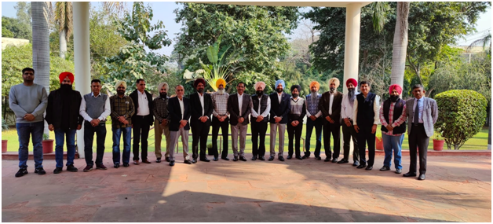 

## Student Activities

## 1. VEHICLE LAUNCH EVENT:

Team GENSONIC of “Society of Automotive Engineer’s Collegiate Club” organized “VEHICLE LAUNCH EVENT” on 6th February, 2023 to aware and encourages the GNDEC students about such initiatives and participation of GNDEC teams among engineering based competitions held at national level.

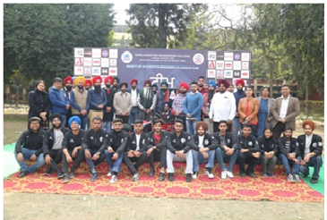
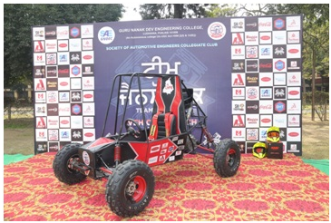

 ## 2. BAJA SAEINDIA 2023: 

Team GENSONIC of “Society of Automotive Engineer’s Collegiate Club” participated in the BAJA SAEINDIA 2023 off-road racing competition from 14th February, 2023 to 19th February, 2023 and bagged the 1st Position in Punjab, Secured AIR 5th in Go Green Event and became the 1st New Team to clear Technical Inspection at the event.

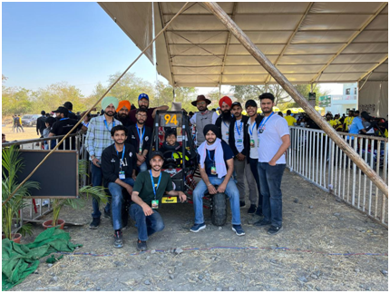
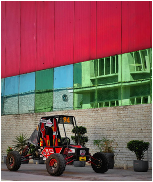

## 3. BAJA SAEINDIA 2024: 

Team GENSONIC of “Society of Automotive Engineer’s Collegiate Club” participated in the BAJA SAEINDIA 2024 off-road racing competition from 9th Junary, 2024 to 14th January, 2024 and bagged the 2nd Position Overall in North India. At this event, Prof. Sukhjeet Singh, Asistant Professor of Mech. & Prod. Engg Dept. was awarded the Dronacharya Award.  

Team GENSONIC secured the following North India Rankings :-
1st in Cost Event.
2nd in Endurance. 
2nd in Acceleration Simulation.
5th in Sales Event.
6th in Design Event.

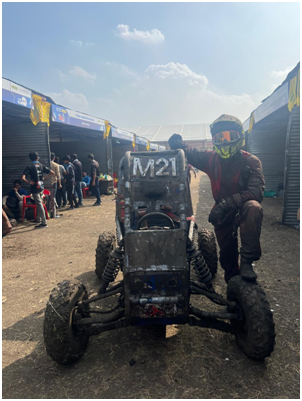
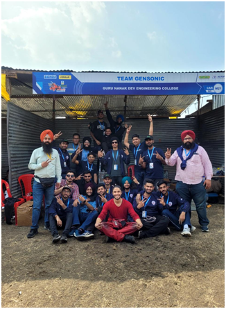
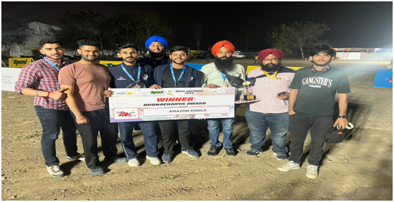

 ## 4. VICTORY CELEBRATION EVENT: 

Team GENSONIC of “Society of Automotive Engineer’s Collegiate Club” organized Victory Celebration Event on 8th February, 2024 to honour the Team’s Sponsors and encourage the GNDEC students about such initiatives and participation of GNDEC teams among engineering based competitions held at national level.

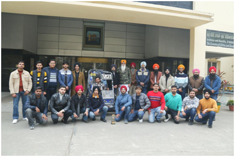
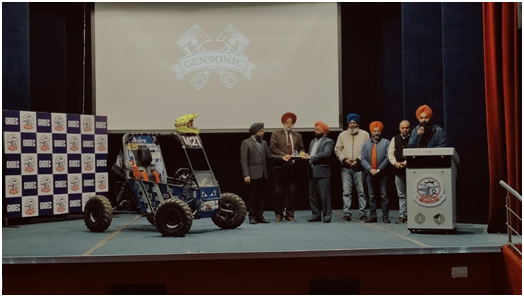
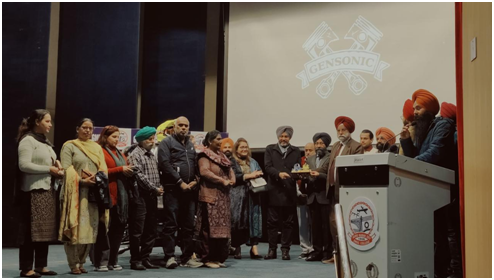

 
 

